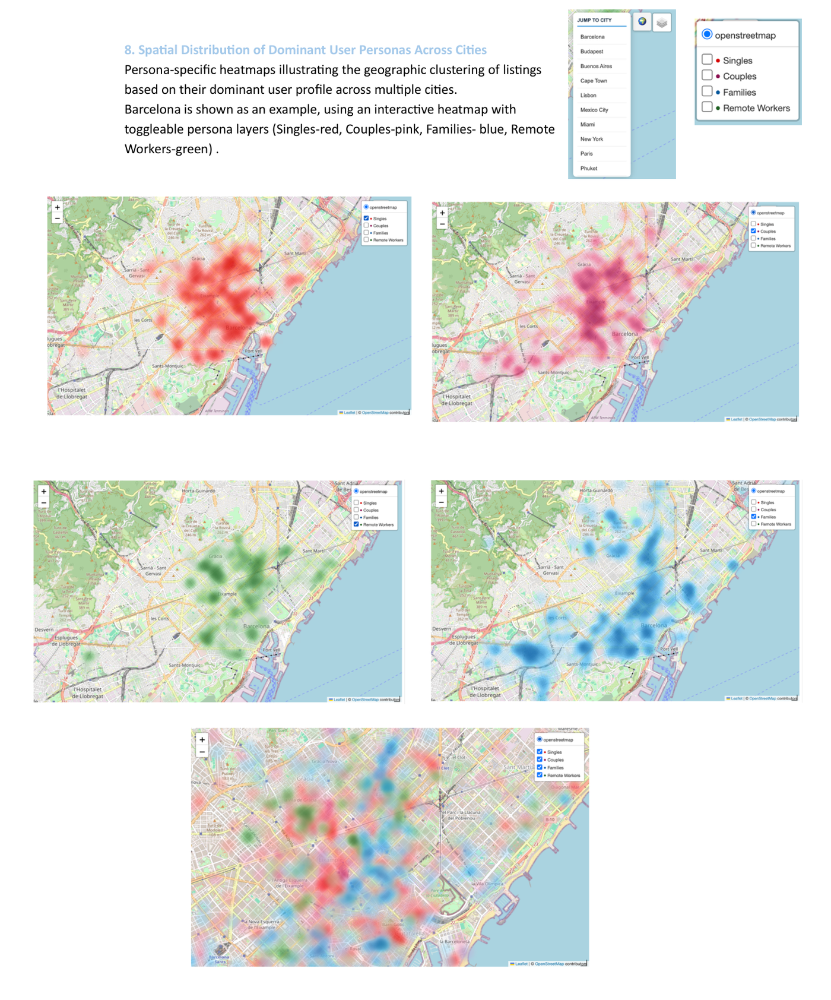
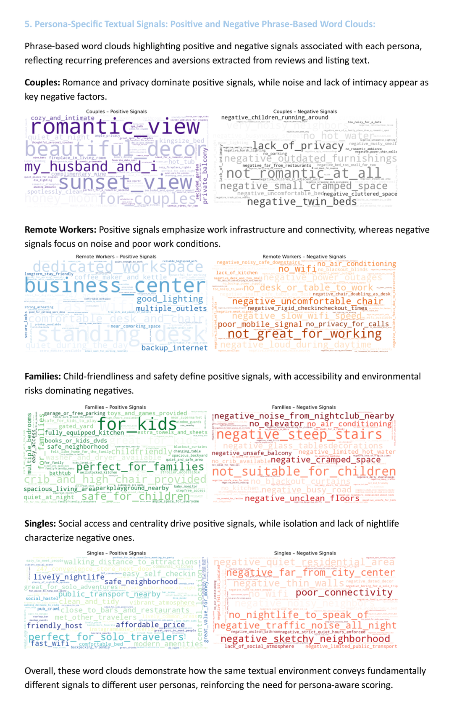

<div align="center">


[](https://htmlpreview.github.io/?https://github.com/elhadif3-dot/PersonaMatch/blob/main/interactive_visual_insights_export.html)
[](https://persona-match-6b33514a.base44.app)
[](https://drive.google.com/file/d/1Q1F-lTSpawZMVKHFGbKJkMCA6dJ1_8kt/view?usp=sharing)


</div>

## Overview

PersonaMatch is an end-to-end data engineering and analytics project that scores Airbnb listings through the needs of different traveler personas. It combines internal Airbnb listing data with external urban context from Google Maps, review text, semantic embeddings, spatial features, and persona-specific business logic.

Instead of producing one generic listing score, the system asks a more product-focused question: which listing is most relevant for which type of traveler?

> 🗺️ **Interactive Visual Insights:** [Open the visual report](https://htmlpreview.github.io/?https://github.com/elhadif3-dot/PersonaMatch/blob/main/interactive_visual_insights_export.html) to see the visualizations that best demonstrate the relevance of the project. Do not miss the dynamic persona maps near the bottom of the report; below them, the report continues with deeper insight into what the maps reveal.

## Project Highlights

- Built a complete pipeline from external data collection to Databricks ETL, semantic enrichment, spatial joins, persona scoring, and visual analysis.
- Combined structured listing attributes with unstructured review text and nearby point-of-interest context.
- Used GloVe-based semantic vectors and persona-specific lexicons to turn raw text into explainable scoring signals.
- Designed separate scoring logic for Singles, Couples, Families, and Remote Workers.
- Captured the Playwright scraping workflow in a short demo video for reviewers who want to see collection in action.
- Includes executed Databricks outputs so the full analytical story can be reviewed without accessing private data workflows.
- Kept credentials, SAS tokens, and raw private datasets outside the public repository.

## Personas

| Persona | What The Pipeline Looks For |
| --- | --- |
| Singles | Urban access, nightlife, local activity, flexible short-stay signals |
| Couples | Experience quality, nearby attractions, comfort, and review sentiment |
| Families | Safety, practical amenities, neighborhood suitability, family-oriented context |
| Remote Workers | Work-friendly signals, convenience, quietness, and long-stay compatibility |

## What Makes It Interesting

- It is not only a notebook analysis. It is a full data product workflow: scraping, ingestion, ETL, modeling, explainability, and visualization.
- The scoring output is persona-aware, making it closer to a real recommendation or ranking engine than a generic EDA exercise.
- The project shows practical Spark, Python, NLP, geospatial logic, and product analytics in one coherent system.

## Scraper In Action

The external Google Maps collection workflow runs as an async Playwright scraper with parallel browser automation, checkpointing, and structured CSV output.

[](https://drive.google.com/file/d/1Q1F-lTSpawZMVKHFGbKJkMCA6dJ1_8kt/view?usp=sharing)

## Methodology

```text
External reviews + Airbnb listing data
        |
        v
Secure Databricks and Azure loading
        |
        v
Spark ETL, cleaning, parsing, and feature preparation
        |
        v
GloVe semantic vectors + persona lexicons
        |
        v
Optimized spatial joins and neighborhood aggregation
        |
        v
Persona-specific listing scores and visual insights
```

## Repository Contents

```text
01_ingest.ipynb              Databricks setup, embeddings, and raw city loading
02_external_eda.ipynb        External review and rating exploratory analysis
03_etl_pipeline.ipynb        Spark ETL, cleaning, parsing, and feature preparation
04_persona_lexicon.ipynb     Persona dictionaries and phrase-based text signals
05_scoring_model.ipynb       Spatial joins, semantic scoring, and final persona model
06_visual_insights.ipynb     Impact analysis, maps, heatmaps, KDE plots, and visual outputs
interactive_visual_insights.html
                             Lightweight launcher for the interactive HTML report
interactive_visual_insights_export.html
                             Full HTML export of the visual insights notebook
data_collection/             External data collection assets and a compact data sample
README.md                    Project documentation
```

## Notebook Organization

The Databricks workflow is organized into focused, recruiter-friendly notebooks that make the project easy to review from ingestion through final visual insights. Key executed outputs are included where available.

| Notebook | Focus |
| --- | --- |
| `01_ingest.ipynb` | Configuration, package setup, GloVe loading, and raw city data loading |
| `02_external_eda.ipynb` | External review quality, rating, length, and semantic analysis |
| `03_etl_pipeline.ipynb` | External and internal data cleaning, parsing, filtering, and preparation |
| `04_persona_lexicon.ipynb` | Persona dictionaries and phrase-based word-cloud analysis |
| `05_scoring_model.ipynb` | Vectorization, spatial joins, full scoring, and internal-only scoring |
| `06_visual_insights.ipynb` | Impact analysis, persona distributions, heatmaps, zones, KDE plots, and interactive maps |

## Data Collection

The `data_collection/` directory includes:

| File | Purpose |
| --- | --- |
| `google_maps_review_scraper.py` | Async Playwright scraper used to collect Google Maps places and review text |
| `data_example.csv` | Compact sample of the external data structure collected for Barcelona |

## Visual Highlights

The strongest visual outputs are the persona-aware spatial maps and the persona-specific text signal dictionaries. They show both sides of the product logic: where each traveler type clusters geographically and which words or phrases explain the score.

<p align="center">
  
</p>

<p align="center">
  
</p>

For the interactive map experience, open the full visual report:

[](https://htmlpreview.github.io/?https://github.com/elhadif3-dot/PersonaMatch/blob/main/interactive_visual_insights_export.html)

## Data And Security

The public repository intentionally excludes:

- Private datasets.
- Azure SAS tokens.
- API credentials.
- Raw external review exports.

Sensitive configuration is removed or expected to be supplied locally. The notebooks include saved outputs from the Databricks workflow where available.

## How To Review

For a fast portfolio review, open the numbered notebooks in order from the repository root. They are organized to show the project story from ingestion to final visual insights, without requiring access to private Databricks data.

To run the full workflow in Databricks:

1. Upload the numbered notebooks to Databricks in order, or run them as one sequential workflow if preferred.
2. Configure the required Azure / Databricks storage access.
3. Run the notebook cells in numeric order.
4. Open the live demo to inspect the product-facing concept.

## Portfolio Summary

Built a persona-aware Airbnb scoring system that combines listing data, external urban context, Google Maps review signals, semantic text features, and geospatial aggregation to produce traveler-specific listing scores.

<div align="center">

[](https://persona-match-6b33514a.base44.app)

</div>
